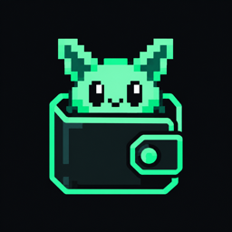
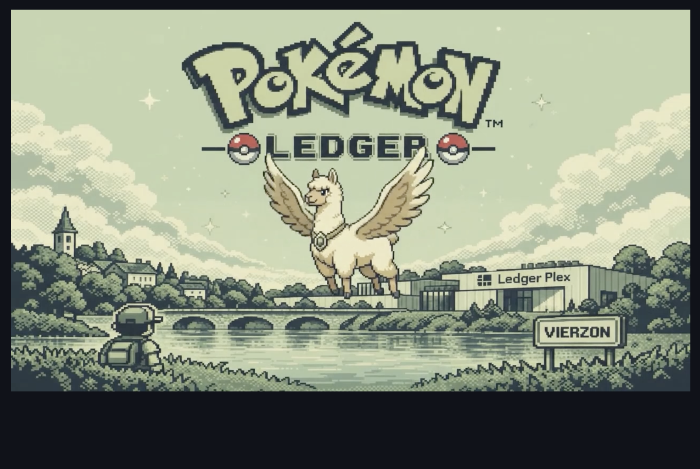
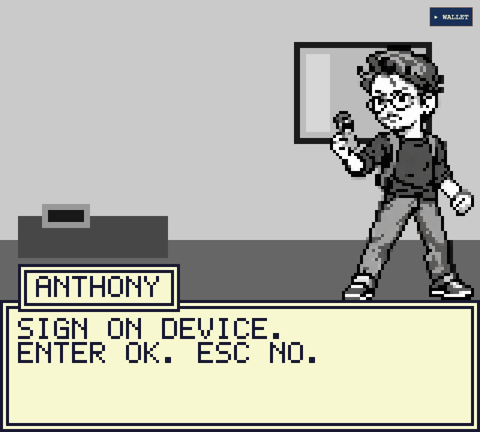
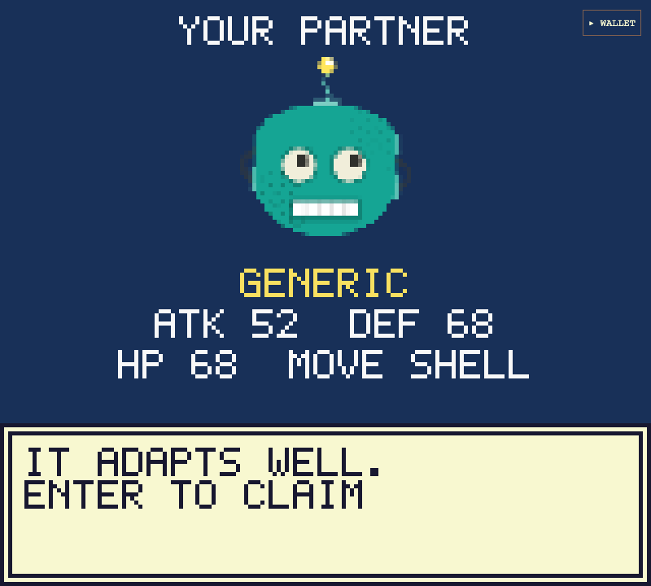
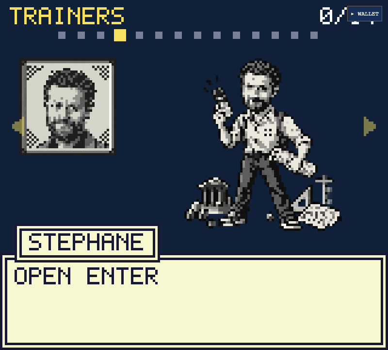
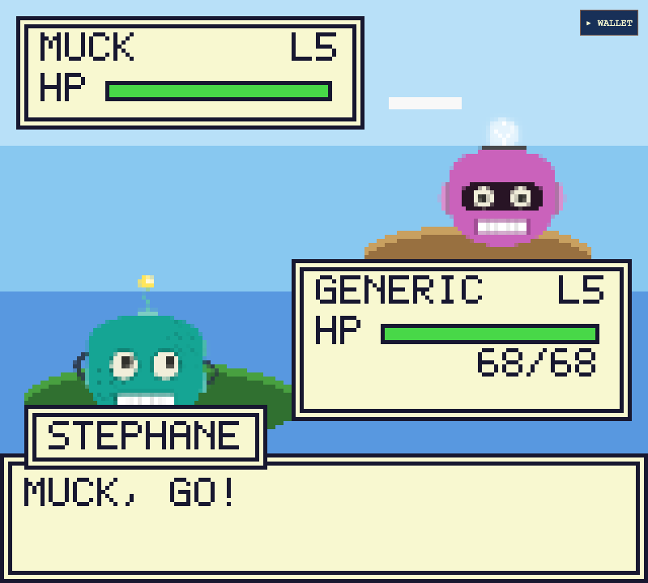
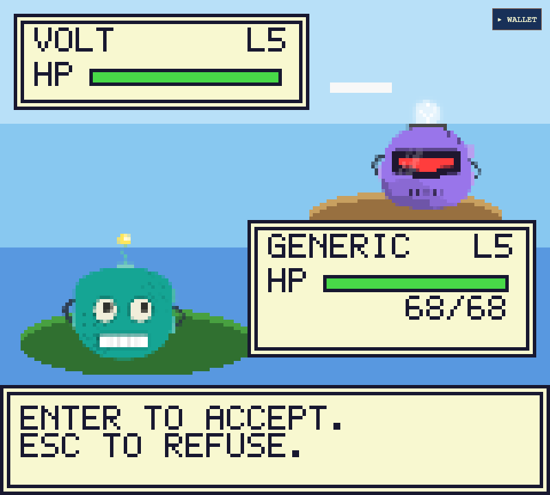

<p align="center">
  
</p>

<h1 align="center">Pokémon Ledger</h1>

<p align="center">
  A Game Boy–style adventure where every important move is signed on your Ledger device.
</p>

<p align="center">
  
</p>

## Why it exists

~~Because it's a hackaton subject lol my peer got sick on the first day big up to him!!~~

Hardware wallets and blockchains are easier to learn by doing than by reading. Pokémon Ledger works like Ledger Quest, with more game in it: you sign on the device, watch your transactions confirm and collect NFTs, all inside a retro RPG.

It runs as a Ledger Wallet Live App on the **Sepolia testnet**. You only pay with free test ETH, and nothing has real value (well, theorically, because a lot of faucets are asking for real funds in an ETH account really that annoyed me so much, i would love to complain in this whole markdown that nobody reads except AI like Claude or whatever idk like for real wtf that's like kama on dofus it's not real give me infinite sepolia please)

By playing, you learn to:

- **Use a Ledger device**: pick an account, review what the screen shows, approve or reject.
- **Tell a message from a transaction**: a message signature is free and creates nothing on chain. A transaction pays gas, goes to a contract and stays in the history.
- **See how a blockchain works**: your starter is derived from your address, fights are settled by a smart contract, and each trophy is an ERC-721 token you can look up on a block explorer.
- **Read before you sign**: one trainer tries to trick you into signing something bad for you. Refusing is the winning move.

## The journey

### 1. Meet Anthony and prove who you are

Anthony, the coin-integration manager, needs a recruit to rescue Obelix (he has been kidnapped by the #team-rocket or whatever). To join, you sign a short message on your device. It is free and creates nothing on chain.

<p>
  
  
</p>

### 2. Claim a partner derived from your address

Your "Ledgermon" (lol) comes from your wallet address. The same address always gets the same partner and stats, on screen and in the contract. Claiming it is your first real transaction, and it mints an NFT.

<p>
  
</p>

### 3. Take on the trainers

Thirteen trainers from the team are waiting, with Panoramix as the final boss. Each fight is a transaction: the contract settles the result, and every win mints a trophy NFT.

<p>
  
  
</p>

### 4. Don't sign everything

One trainer (*cough cough* i wonder who that is *cough cough*) offers you an easy victory if you sign his message. Read the device screen carefully: the message says `YOU LOSE IMMEDIATLY`. If you approve, you lose. If you reject, you win. Clear signing is about exactly this habit.

<p>
  
</p>

## Run it

```sh
pnpm install
pnpm dev
```

The game opens on `http://localhost:8080` in **mock mode**. No device or wallet is needed: Enter approves and Escape refuses.

To play with a real device:

1. Copy `.env.example` to `.env.local` and set `VITE_WALLET_MODE=ledger`.
2. In Ledger Wallet, enable Developer mode and add `manifest.json` as a local Live App.
3. Add an Ethereum Sepolia account with some test ETH, then open the app inside Ledger Wallet.

## Tech stack

- [Phaser 4](https://phaser.io) and React, bundled with Vite
- [Ledger Wallet API]([https://developers.ledger.com/docs/ledger-live/discover/integration/wallet-api](https://developers.ledger.com/docs/ledger-live/discover/integration/wallet-api/introduction)) for accounts, message signing and transactions
- [viem](https://viem.sh) for Sepolia reads and signature checks
- A Solidity ERC-721 contract (`chain/contracts/LedgerMon.sol`), built with Hardhat and OpenZeppelin

## Checks

```sh
pnpm typecheck
pnpm test        # unit tests
pnpm chain:test  # contract tests
pnpm test:e2e    # browser playthrough in mock mode
pnpm build
```

`pnpm chain:compile` rebuilds the contract, then regenerates the ABI, the bytecode and the NFT portraits.

> Rewards are for demonstration only. Battle randomness is deliberately simple and is not suitable for anything of real value.
